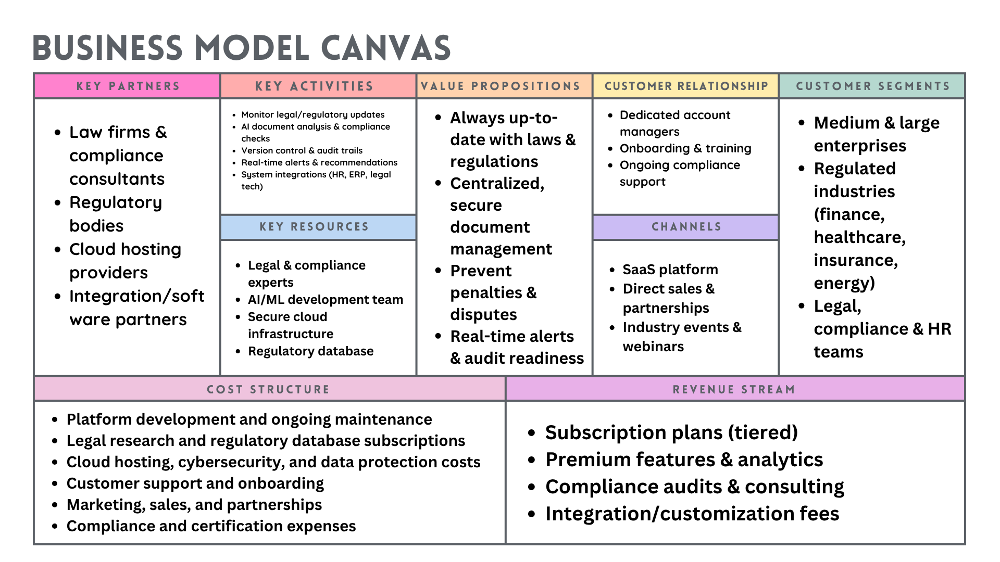

## Full-stack Gemini App (React + Tailwind + Express)

Run the React frontend and Express backend together. The backend proxies requests to the Gemini API. All code is JavaScript.

### Prereqs
- Node.js 18+

### Setup
1. Create the environment file for the backend:
   - Create `server/.env` with:
     ```
     GEMINI_API_KEY=your_api_key_here
     PORT=5000
     ```

2. Install dependencies for both apps:
   ```bash
   npm run install-all
   ```

3. Start both servers (concurrently):
   ```bash
   npm run dev
   ```

Frontend: `http://localhost:5173`  
Backend: `http://localhost:5000`

### Notes
- The frontend calls the backend route `POST /api/gemini` with `{ prompt }`.
- The backend uses `axios` to call the Gemini API and returns JSON like `{ text, raw }`.
- Tailwind CSS is configured in the `client/` folder with Vite.


